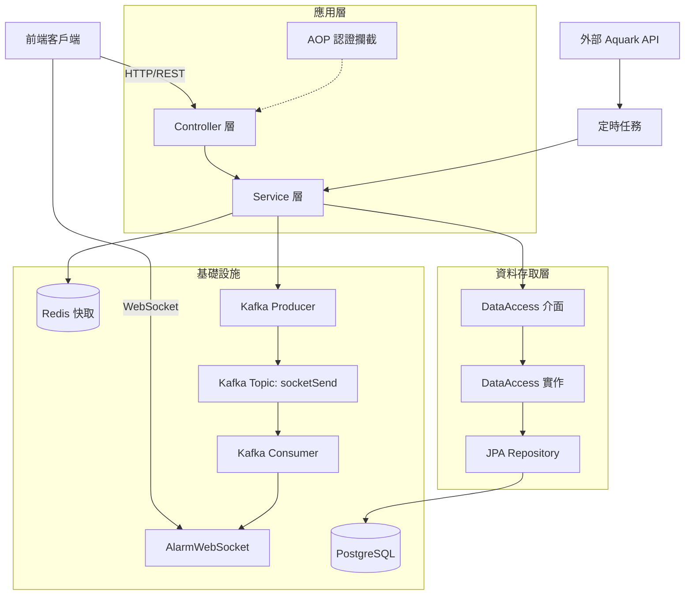
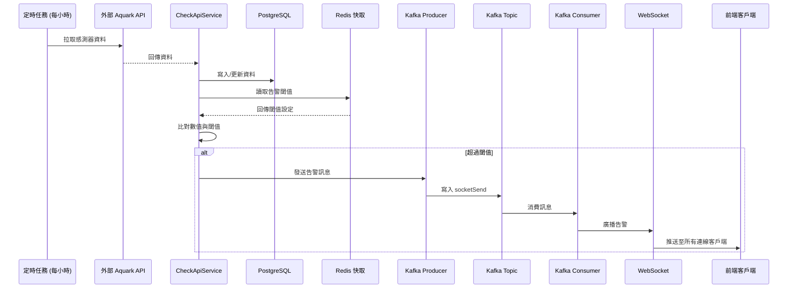
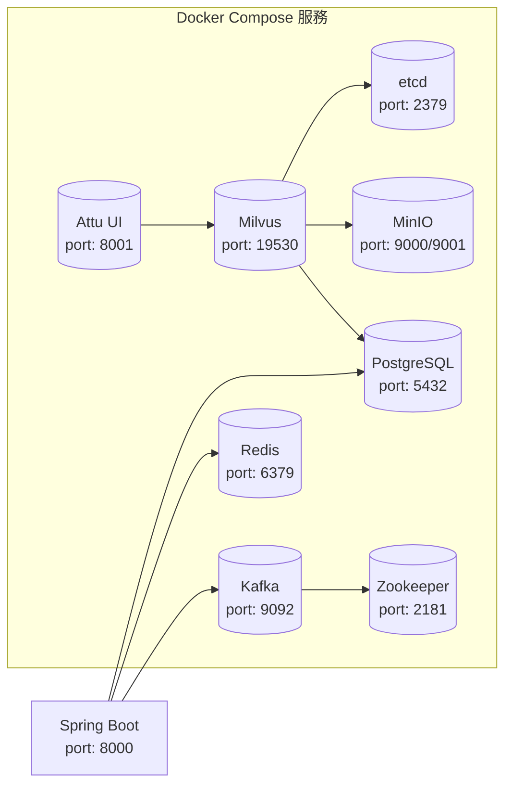

## 專案目的

此專案用於整理與實作常見後端架構與平台功能，
包含：

- JWT / RBAC 權限管理
- WebSocket 即時通知
- Kafka 非同步事件處理
- Redis 快取
- Docker 化部署
- API validation 與統一例外處理

並模擬具備使用者、角色、技能管理與告警通知的平台型系統。

# Java 21 Spring Boot 常見技術 實作方法

通用後端範例專案，整合使用者/角色/權限、專案/技能管理、資料查詢與告警設定等常見後端需求，並提供 REST API、WebSocket 與 Kafka Consumer，且已實作註解式角色權限控管機制。

## 技術棧

- Java 21
- Spring Boot 3.4.2
- Spring Web / Spring Data JPA
- PostgreSQL / Redis
- Kafka + Zookeeper
- WebSocket
- Springdoc OpenAPI (Swagger UI)
- JUnit 5 / Mockito / H2 (測試)

## 系統架構

### 分層架構



### 告警通知流程



### 基礎設施拓撲



### 資料模型

系統採用關聯式資料模型，按業務領域拆分為 4 大模組：

#### 1. 權限管理模組 (RBAC)

```mermaid
erDiagram
    USER ||--o{ USER_ROLE : "has"
    ROLE ||--o{ USER_ROLE : "assigned"
    ROLE ||--o{ ROLE_FUNCTION : "grants"
    FUNCTION ||--o{ ROLE_FUNCTION : "granted_to"
    
    USER {
        uuid id PK
        string email UK "唯一"
        string name
        boolean disabled
    }
    
    ROLE {
        uuid id PK
        string name
        string description
    }
    
    FUNCTION {
        uuid id PK
        string name
        string parent "父功能"
        integer type
    }
    
    USER_ROLE {
        uuid id PK
        uuid user_id FK
        uuid role_id FK
        constraint "UK(user_id,role_id)"
    }
    
    ROLE_FUNCTION {
        uuid id PK
        uuid role_id FK
        uuid function_id FK
    }
```

#### 2. 技能管理模組

```mermaid
erDiagram
    SKILL ||--o{ SKILL_LEVEL : "has_levels"
    USER ||--o{ USER_SKILL : "owns"
    SKILL ||--o{ USER_SKILL : "learned"
    SKILL_LEVEL ||--o{ USER_SKILL : "at_level"
    
    SKILL {
        uuid id PK
        string name
        string description
    }
    
    SKILL_LEVEL {
        uuid id PK
        uuid skill_id FK
        integer level_value
        string title
        string description
        constraint "UK(skill_id,level_value)"
    }
    
    USER_SKILL {
        uuid id PK
        uuid user_id FK
        uuid skill_id FK
        uuid skill_level_id FK
        constraint "UK(user_id,skill_id)"
    }
```

#### 3. 專案管理模組

```mermaid
erDiagram
    PROJECT ||--o{ PROJECT_SKILL : "requires"
    PROJECT ||--o{ USER_PROJECT : "has_members"
    USER ||--o{ USER_PROJECT : "member_of"
    SKILL ||--o{ PROJECT_SKILL : "required"
    SKILL_LEVEL ||--o{ PROJECT_SKILL : "level"
    
    PROJECT {
        uuid id PK
        string name
        string description
    }
    
    PROJECT_SKILL {
        uuid id PK
        uuid project_id FK
        uuid skill_id FK
        uuid skill_level_id FK
        constraint "UK(project_id,skill_id)"
    }
    
    USER_PROJECT {
        uuid id PK
        uuid user_id FK
        uuid project_id FK
        constraint "UK(user_id,project_id)"
    }
```

#### 4. 專案成員技能模組 🆕

```mermaid
erDiagram
    USER ||--o{ USER_PROJECT_SKILL : "exhibits"
    PROJECT ||--o{ USER_PROJECT_SKILL : "member_skills"
    SKILL ||--o{ USER_PROJECT_SKILL : "used"
    SKILL_LEVEL ||--o{ USER_PROJECT_SKILL : "level"
    
    USER_PROJECT_SKILL {
        uuid id PK
        uuid user_id FK
        uuid project_id FK
        uuid skill_id FK
        uuid skill_level_id FK
        constraint "UK(user_id,project_id,skill_id)"
    }
```

**核心資料表說明**：

| 資料表 | 類型 | 用途 | 唯一約束 |
|--------|------|------|----------|
| `user` | 主實體 | 使用者資訊 | email |
| `role` | 主實體 | 角色定義 | - |
| `function` | 主實體 | 功能權限（樹狀結構） | - |
| `skill` | 主實體 | 技能定義 | - |
| `skill_level` | 主實體 | 技能等級（隸屬於技能） | (skill_id, level_value) |
| `project` | 主實體 | 專案資訊 | - |
| `user_role` | 關聯表 | 使用者角色綁定 | (user_id, role_id) |
| `role_function` | 關聯表 | 角色權限綁定 | - |
| `user_skill` | 關聯表 | 使用者個人技能庫 | (user_id, skill_id) |
| `project_skill` | 關聯表 | 專案技能需求 | (project_id, skill_id) |
| `user_project` | 關聯表 | 專案成員 | (user_id, project_id) |
| `user_project_skill` | 關聯表 | 🆕 專案成員技能（使用者在特定專案的技能等級） | (user_id, project_id, skill_id) |

**資料模型設計特點**：
- ✅ 所有 Entity 繼承 `BaseEntity`，自動擁有 `id` (UUID)、審計欄位 (`created_by`, `created_time`, `updated_by`, `updated_time`)
- ✅ 使用複合唯一約束防止重複綁定關係
- ✅ `user_project_skill` 為四向關聯表，支援「使用者在不同專案展現不同技能等級」的業務場景
- ✅ `skill_level` 與 `skill` 為一對多關係，確保等級定義與技能綁定
- ✅ `function` 支援樹狀結構（parent 欄位），實現階層式功能選單

## 技術選型說明

| 技術 | 用途 | 選型原因 |
|------|------|----------|
| **Java 21** | 程式語言 | LTS 版本，支援虛擬執行緒、Record Patterns 等新特性 |
| **Spring Boot 3.4.2** | 核心框架 | 生態系完整、自動配置簡化開發、內建 Actuator 監控 |
| **Spring Data JPA** | ORM 框架 | 減少樣板程式碼、支援 Specification 動態查詢、與 Spring 生態無縫整合 |
| **PostgreSQL** | 關聯式資料庫 | 開源、支援 JSONB/UUID/陣列等進階型別、效能優異 |
| **Redis** | 快取層 | 高效能、支援多種資料結構、Spring Cache 原生整合 |
| **Kafka** | 非同步訊息佇列 | 高吞吐、持久化、支援消費者群組，適合事件驅動架構 |
| **WebSocket** | 即時通訊 | 全雙工通訊，適合告警即時推送場景 |
| **jose4j** | JWT 處理 | 支援 JWS/JWE 標準、API 設計清晰、安全性高 |
| **MapStruct** | DTO 映射 | 編譯期產生程式碼、效能優於反射、型別安全 |
| **Lombok** | 程式碼簡化 | 減少 getter/setter/constructor 樣板程式碼 |
| **Docker Compose** | 本地開發環境 | 一鍵啟動所有依賴服務、環境一致性高 |
| **JUnit 5 + Mockito** | 測試框架 | 業界標準、支援參數化測試、Mock 功能完善 |
| **JaCoCo** | 覆蓋率工具 | 與 Maven 無縫整合、支援 XML/HTML 報告 |

## 功能模組拆分

| 模組 | 說明 | 主要端點 |
|------|------|----------|
| **認證授權模組** | JWT 簽發與驗證、RBAC 權限模型 (User → Role → Function) | `/auth/login`, `/auth/signup` |
| **使用者管理模組** | 使用者 CRUD、技能綁定、專案綁定、角色綁定、分頁搜尋 | `/users/*` |
| **專案管理模組** | 一般/個人專案管理、技能綁定、成員技能管理、擁有者權限控制 | `/project/*` |
| **技能管理模組** | 技能/等級 CRUD、個人/專案維度技能管理 | `/skill/*` |
| **角色與功能模組** | 角色/功能 CRUD、雙向綁定、階層式功能選單 | `/role/*`, `/function/*` |
| **管理者綁定模組** | 統一管理使用者-專案、使用者-技能、專案-技能、專案成員技能等多對多綁定關係，採用完整覆蓋式 API 設計 | `/admin/bindings/*` |
| **告警通知模組** | 定時拉取外部資料、閾值比對、Kafka 非同步推送、WebSocket 即時通知 | `/alertCheckLimit/*` |
| **資料查詢模組** | Aquark 感測器資料查詢、動態條件過濾、Redis 快取 | `/aquarkData/*` |

## 工程實踐

### 分層架構
採用標準三層架構，並額外抽象 DataAccess 層：
```
Controller → Service → DataAccess Interface → DataAccessImpl → Repository → JPA/Hibernate
```
DataAccess 層將資料存取邏輯從 Service 中分離，便於測試與替換實作。

### 快取策略
- 使用 Spring Cache 抽象層，以 `@Cacheable` / `@CachePut` / `@CacheEvict` 管理
- Redis 採用 JSON 序列化，支援多型型別
- 各快取區域獨立 TTL：users (2h)、alertCheckLimit (1h)、aquarkData (1h)

### 非同步事件處理
- 告警訊息透過 Kafka `socketSend` topic 非同步傳輸
- 消費者群組 `myGroup` 確保訊息可靠消費
- 解耦資料檢查與即時推送邏輯

### Spring Security 認證攔截
- 整合 `spring-boot-starter-security`，使用 `SecurityFilterChain` 與自訂 `JwtAuthenticationFilter`
- JWT 驗證失敗直接回傳 401，不進入業務邏輯
- 通過驗證後將 CustomUserDetails 物件注入 `SecurityContextHolder` 供後續存取
- 利用 `IgnoreUrlsProvider` 動態掃描 `@Ingnore` 註解，自動配置 `permitAll()` 規則，並保留原本簡潔的開發體驗
- 登入機制改用 Spring Security 內建之 `AuthenticationManager` 處理密碼比對
- 密碼儲存與驗證改用 `DelegatingPasswordEncoder`：預設使用 `bcrypt` 進行加密 (新密碼會帶有 `{bcrypt}` 前綴)，同時向下相容舊資料庫中未帶前綴的裸 bcrypt 密碼，保有未來無縫切換其他加密演算法 (如 Argon2) 的擴充彈性

### 動態查詢
- 使用 JPA Specification 實現分頁與多條件搜尋
- 複雜查詢 (AquarkData) 使用 Criteria API 動態建構

### DTO 映射
- MapStruct 編譯期產生映射程式碼，效能優於反射
- 支援 `@AfterMapping` 處理複雜轉換 (如權限解析)

### 測試與覆蓋率
- JUnit 5 + Mockito 單元測試
- H2 in-memory database 隔離測試環境
- JaCoCo 覆蓋率要求 ≥ 80% (排除介面、Entity、DTO 等樣板層)

### Docker Compose 本地開發
- 一鍵啟動 PostgreSQL、Redis、Kafka、Zookeeper、Milvus 等服務
- 環境變數模板化 (`.env.example`)，便於團隊協作

### 統一例外處理
- `GlobalExceptionHandler` 集中處理所有異常
- 標準化回應格式：`ResponseType<T>` (code, data, message, errorType)
- 自訂 `AppException` 支援 HTTP 狀態碼與錯誤型別設定

## 後續規劃

- [x] **CI/CD 管線**: 整合 GitHub Actions，自動化測試、建置、部署
- [x] **管理者綁定 API 重構**: 統一 Rebind API 設計，完整覆蓋語意，Diff 策略最佳化
- [x] **專案成員技能管理**: 新增 `user_project_skill` 表，支援專案維度技能管理
- [ ] **監控與日誌**: 引入 Micrometer + Prometheus + Grafana，集中化日誌管理
- [ ] **效能優化**: 資料庫查詢優化、連線池調整、虛擬執行緒應用
- [ ] **API 版本管理**: 引入 URI/Header 版本控制，向後相容
- [ ] **安全強化**: 速率限制、CORS 細部控制、SQL 注入防護審計
- [ ] **文件完善**: API 文件自動化、架構決策記錄 (ADR)
- [ ] **微服務拆分評估**: 依業務邊界拆分服務，引入 API Gateway
- [ ] **向量搜尋應用**: 整合 Milvus 實現語意搜尋、RAG 應用

## 提供的介面類型

- REST API
- WebSocket
- Kafka Consumer

## 啟動方式

### Docker Compose

1. 啟動基礎服務（PostgreSQL、Redis、Kafka、Zookeeper）

```bash
docker compose -f compose.yaml up -d
```

2. 可選：先複製環境變數模板再調整

```bash
cp .env.example .env
```

3. 本機啟動後端（見下方）

### 本機啟動

```bash
./mvnw spring-boot:run
```

### Docker 內啟動後端

若後端服務跑在 Docker 內，請設定 `APP_IN_DOCKER=true`。
當 `APP_IN_DOCKER=true` 且未手動指定 `KAFKA_BOOTSTRAP_SERVERS` 時，後端會自動使用 `kafka:9092`。
否則（預設）會使用 `localhost:9092`。

Kafka 對外廣播主機可用 `KAFKA_ADVERTISED_HOST` 控制：

- Docker 內互連：`KAFKA_ADVERTISED_HOST=kafka`
- 本機連線：`KAFKA_ADVERTISED_HOST=localhost`

## 重要設定

- 服務埠：`8000`
- JWT Secret：`jwt.secret.use`
- PostgreSQL：`localhost:5432`
- Redis：`localhost:6379`
- Kafka：`localhost:9092`

可在 `compose.yaml` 查看各服務連線設定。

## Swagger

- `http://localhost:8000/swagger-ui/index.html`

## 測試與覆蓋率

```bash
./mvnw test
./mvnw jacoco:report
```

覆蓋率報告位置：`target/site/jacoco/index.html`