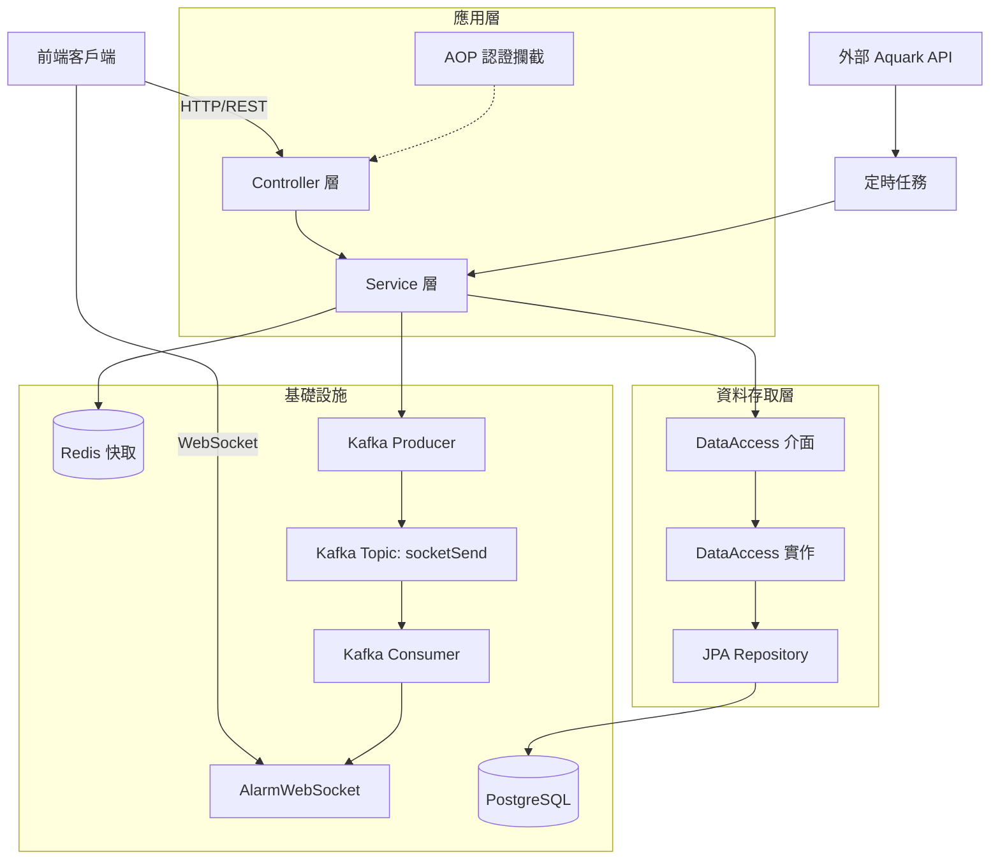
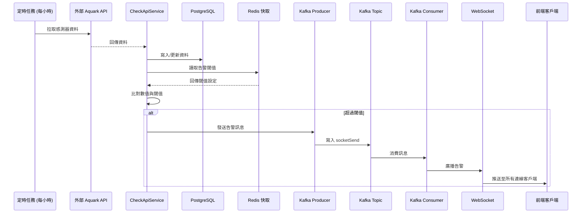
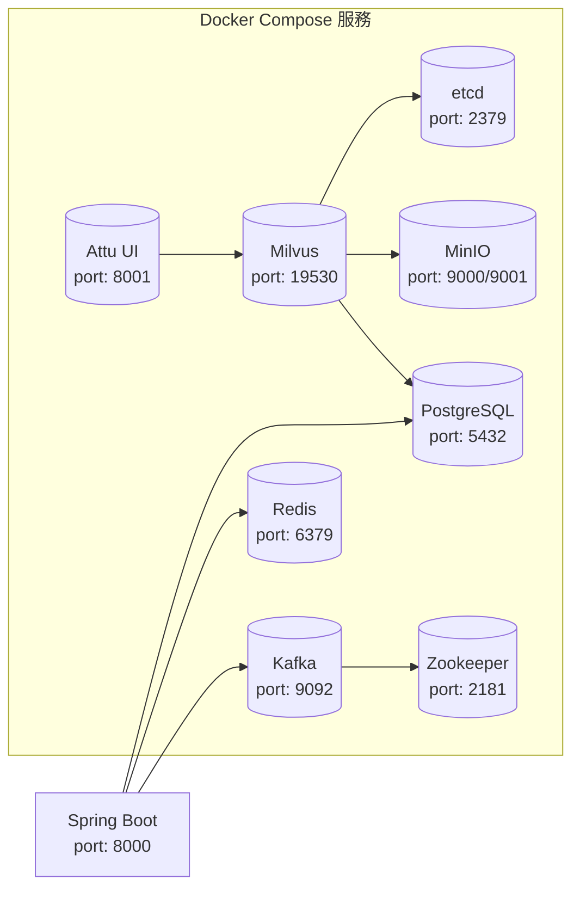
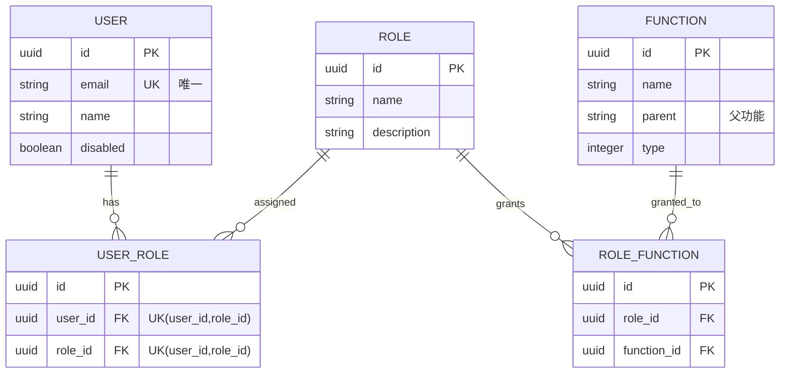
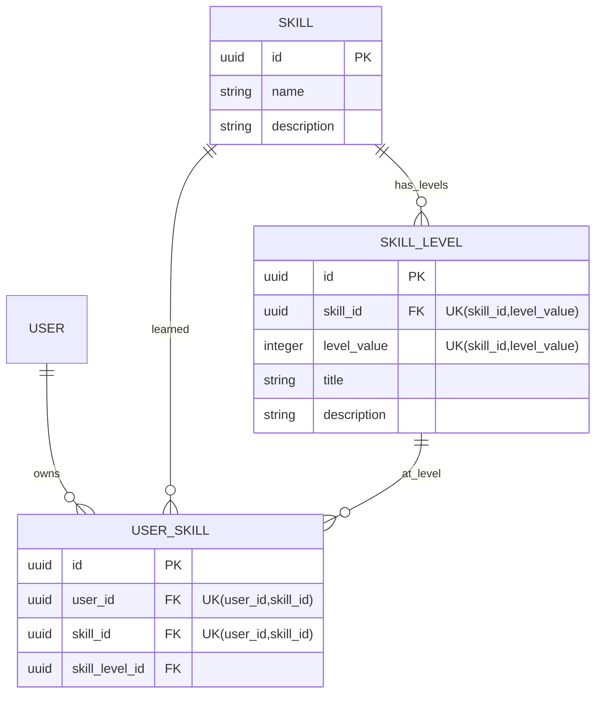
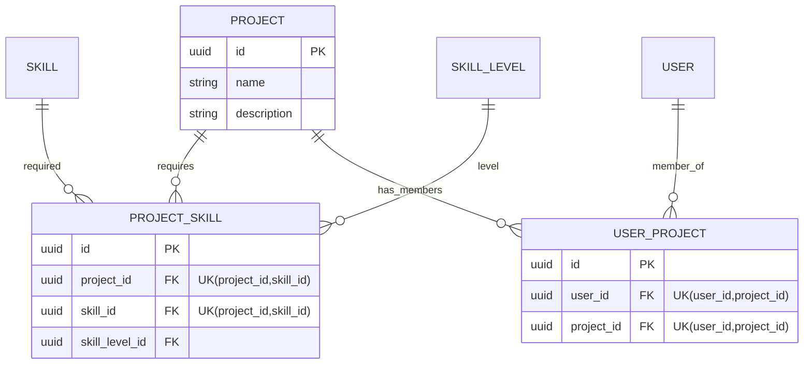
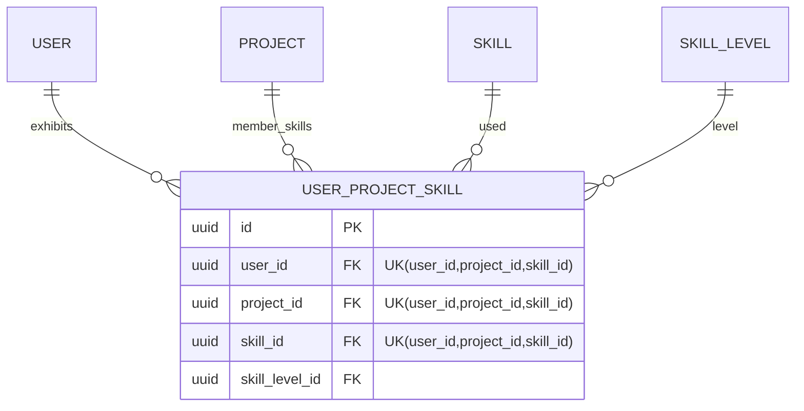
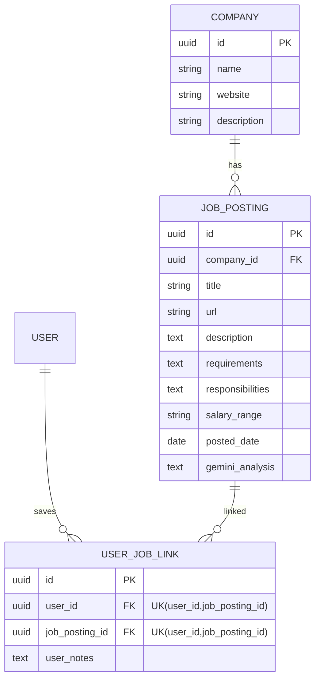

## 專案目的

此專案用於整理與實作常見後端架構與平台功能，
包含：

- JWT / RBAC 權限管理
- WebSocket 即時通知
- Kafka 非同步事件處理
- Redis 快取
- Docker 化部署
- API validation 與統一例外處理

並模擬具備使用者、角色、技能管理與告警通知的平台型系統。

# Java 21 Spring Boot 常見技術 實作方法

通用後端範例專案，整合使用者/角色/權限、專案/技能管理、資料查詢與告警設定等常見後端需求，並提供 REST API、WebSocket 與 Kafka
Consumer，且已實作註解式角色權限控管機制。

## 技術棧

- Java 21
- Spring Boot 3.4.2
- Spring Web / Spring Data JPA
- PostgreSQL / Redis
- Kafka + Zookeeper
- WebSocket
- Springdoc OpenAPI (Swagger UI)
- JUnit 5 / Mockito / H2 (測試)

## 系統架構

### 分層架構



### 告警通知流程



### 基礎設施拓撲



### 資料模型

系統採用關聯式資料模型，按業務領域拆分為 4 大模組：

#### 1. 權限管理模組 (RBAC)



#### 2. 技能管理模組



#### 3. 專案管理模組



#### 4. 專案成員技能模組 🆕



#### 5. 公司與職缺管理模組 🆕



**核心資料表說明**：

| 資料表                  | 類型  | 用途                       | 唯一約束                            |
|----------------------|-----|--------------------------|---------------------------------|
| `user`               | 主實體 | 使用者資訊                    | email                           |
| `role`               | 主實體 | 角色定義                     | -                               |
| `function`           | 主實體 | 功能權限（樹狀結構）               | -                               |
| `skill`              | 主實體 | 技能定義                     | -                               |
| `skill_level`        | 主實體 | 技能等級（隸屬於技能）              | (skill_id, level_value)         |
| `project`            | 主實體 | 專案資訊                     | -                               |
| `user_role`          | 關聯表 | 使用者角色綁定                  | (user_id, role_id)              |
| `role_function`      | 關聯表 | 角色權限綁定                   | -                               |
| `user_skill`         | 關聯表 | 使用者個人技能庫                 | (user_id, skill_id)             |
| `project_skill`      | 關聯表 | 專案技能需求                   | (project_id, skill_id)          |
| `user_project`       | 關聯表 | 專案成員                     | (user_id, project_id)           |
| `user_project_skill` | 關聯表 | 🆕 專案成員技能（使用者在特定專案的技能等級） | (user_id, project_id, skill_id) |
| `company`            | 主實體 | 公司/企業資訊                  | -                               |
| `job_posting`        | 主實體 | 職缺資訊（含 Gemini 分析結果）      | -                               |
| `user_job_link`      | 關聯表 | 使用者儲存的職缺（個人收藏）           | (user_id, job_posting_id)       |

**資料模型設計特點**：

- ✅ 所有 Entity 繼承 `BaseEntity`，自動擁有 `id` (UUID)
  、審計欄位 (`created_by`, `created_time`, `updated_by`, `updated_time`)
- ✅ 使用複合唯一約束防止重複綁定關係
- ✅ `user_project_skill` 為四向關聯表，支援「使用者在不同專案展現不同技能等級」的業務場景
- ✅ `skill_level` 與 `skill` 為一對多關係，確保等級定義與技能綁定
- ✅ `function` 支援樹狀結構（parent 欄位），實現階層式功能選單

## 技術選型說明

| 技術                    | 用途           | 選型原因                                            |
|-----------------------|--------------|-------------------------------------------------|
| **Java 21**           | 程式語言         | LTS 版本，支援虛擬執行緒、Record Patterns 等新特性             |
| **Spring Boot 3.4.2** | 核心框架         | 生態系完整、自動配置簡化開發、內建 Actuator 監控                   |
| **Spring Data JPA**   | ORM 框架       | 減少樣板程式碼、支援 Specification 動態查詢、與 Spring 生態無縫整合   |
| **PostgreSQL**        | 關聯式資料庫       | 開源、支援 JSONB/UUID/陣列等進階型別、效能優異                   |
| **Redis**             | 快取層          | 高效能、支援多種資料結構、Spring Cache 原生整合                  |
| **Kafka**             | 非同步訊息佇列      | 高吞吐、持久化、支援消費者群組，適合事件驅動架構                        |
| **WebSocket**         | 即時通訊         | 全雙工通訊，適合告警即時推送場景                                |
| **jose4j**            | JWT 處理       | 支援 JWS/JWE 標準、API 設計清晰、安全性高                     |
| **MapStruct**         | DTO 映射       | 編譯期產生程式碼、效能優於反射、型別安全                            |
| **Lombok**            | 程式碼簡化        | 減少 getter/setter/constructor 樣板程式碼              |
| **Jsoup**             | HTML 解析與網頁爬蟲 | 輕量級靜態頁面爬取，支援 CSS Selector 與 DOM 操作，適合結構化頁面      |
| **Selenium**          | 動態網頁爬蟲       | 瀏覽器自動化工具，處理 JavaScript 渲染頁面，作為 Jsoup 的 fallback |
| **ONNX Runtime**      | AI 模型推論引擎   | 用於執行本地端的 Whisper 模型進行語音辨識 (STT)                  |
| **jave-all-deps**     | 音訊轉檔工具      | 基於 FFmpeg，用於將各類音訊檔轉換為 Whisper 需要的 16kHz PCM    |
| **Kuromoji**          | 日文 NLP 工具    | 日文形態素分析與片假名拼音萃取                                 |
| **Pinyin4j/Bopomofo** | 中文拼音/注音轉換   | 中文字轉漢語拼音及注音符號轉換引擎                               |
| **Gemini API**        | AI 智能分析      | Google Gemini REST API，用於從爬取內容中結構化萃取職缺資訊        |
| **Gson**              | JSON 序列化     | Google 官方 JSON 庫，用於 Gemini API 請求/回應處理          |
| **Docker Compose**    | 本地開發環境       | 一鍵啟動所有依賴服務、環境一致性高                               |
| **JUnit 5 + Mockito** | 測試框架         | 業界標準、支援參數化測試、Mock 功能完善                          |
| **JaCoCo**            | 覆蓋率工具        | 與 Maven 無縫整合、支援 XML/HTML 報告                     |

## 功能模組拆分

| 模組          | 說明                                                    | 主要端點                          |
|-------------|-------------------------------------------------------|-------------------------------|
| **認證授權模組**  | JWT 簽發與驗證、RBAC 權限模型 (User → Role → Function)          | `/auth/login`, `/auth/signup` |
| **使用者管理模組** | 使用者 CRUD、技能綁定、專案綁定、角色綁定、分頁搜尋                          | `/users/*`                    |
| **專案管理模組**  | 一般/個人專案管理、技能綁定、成員技能管理、擁有者權限控制                         | `/project/*`                  |
| **技能管理模組**  | 技能/等級 CRUD、個人/專案維度技能管理                                | `/skill/*`                    |
| **角色與功能模組** | 角色/功能 CRUD、雙向綁定、階層式功能選單                               | `/role/*`, `/function/*`      |
| **管理者綁定模組** | 統一管理使用者-專案、使用者-技能、專案-技能、專案成員技能等多對多綁定關係，採用完整覆蓋式 API 設計 | `/admin/bindings/*`           |
| **公司管理模組**  | 公司 CRUD，作為職缺的隸屬企業                                     | `/company/*`                  |
| **職缺管理模組**  | 職缺 CRUD、依公司查詢、爬蟲結果儲存                                  | `/job-posting/*`              |
| **爬蟲分析模組**  | Jsoup/Selenium 複合爬蟲抓取公司網站 + Gemini API 智能分析職缺資訊       | `內部服務`                        |
| **AI 語音辨識模組**| 整合 ONNX Runtime 與 Whisper 進行 STT，支援中日文羅馬音/注音/拼音轉換      | `/stt/v1/*`                   |
| **告警通知模組**  | 定時拉取外部資料、閾值比對、Kafka 非同步推送、WebSocket 即時通知              | `/alertCheckLimit/*`          |
| **資料查詢模組**  | Aquark 感測器資料查詢、動態條件過濾、Redis 快取                        | `/aquarkData/*`               |

## 工程實踐

### 分層架構

採用標準三層架構，並額外抽象 DataAccess 層：

```
Controller → Service → DataAccess Interface → DataAccessImpl → Repository → JPA/Hibernate
```

DataAccess 層將資料存取邏輯從 Service 中分離，便於測試與替換實作。

### 快取策略

- 使用 Spring Cache 抽象層，以 `@Cacheable` / `@CachePut` / `@CacheEvict` 管理
- Redis 採用 JSON 序列化，支援多型型別
- 自訂 `CacheErrorHandler`：當 Redis 反序列化失敗時自動清除該快取鍵值，
  讓下次請求回退至資料庫查詢，避免服務中斷
- 全 Service 層已加入快取註解，分為三層級 TTL 策略（詳見 `redis快取策略.md`）：
    - **參考資料**（24h）：skills、skillLevels、functions
    - **業務資料**（1-6h）：roles（6h）、companies（6h）、jobPostings（1h）
    - **使用者資料**（10-30min）：currentUserSkills、userProjects、userJobLinks、userRoles

### 非同步事件處理

- 告警訊息透過 Kafka `socketSend` topic 非同步傳輸
- 消費者群組 `myGroup` 確保訊息可靠消費
- 解耦資料檢查與即時推送邏輯

### Spring Security 認證攔截

- 整合 `spring-boot-starter-security`，使用 `SecurityFilterChain` 與自訂 `JwtAuthenticationFilter`
- JWT 驗證失敗直接回傳 401，不進入業務邏輯
- 通過驗證後將 CustomUserDetails 物件注入 `SecurityContextHolder` 供後續存取
- 利用 `IgnoreUrlsProvider` 動態掃描 `@Ingnore` 註解，自動配置 `permitAll()` 規則，並保留原本簡潔的開發體驗
- 透過 `@RequirePermission({"System", "Function", "View"})` 註解在 Controller 方法上，宣告「模組 + 功能 + 操作」三層權限，
  由 AOP 攔截器自動檢查當前使用者的角色是否具備對應功能權限
- 登入機制改用 Spring Security 內建之 `AuthenticationManager` 處理密碼比對
- 密碼儲存與驗證改用 `DelegatingPasswordEncoder`：預設使用 `bcrypt` 進行加密 (新密碼會帶有 `{bcrypt}` 前綴)
  ，同時向下相容舊資料庫中未帶前綴的裸 bcrypt 密碼，保有未來無縫切換其他加密演算法 (如 Argon2) 的擴充彈性

### 動態查詢

- 使用 JPA Specification 實現分頁與多條件搜尋
- 複雜查詢 (AquarkData) 使用 Criteria API 動態建構

### DTO 映射

- MapStruct 編譯期產生映射程式碼，效能優於反射
- 支援 `@AfterMapping` 處理複雜轉換 (如權限解析)

### 測試與覆蓋率

- JUnit 5 + Mockito 單元測試
- H2 in-memory database 隔離測試環境
- JaCoCo 覆蓋率要求 ≥ 80% (排除介面、Entity、DTO 等樣板層)

### Docker Compose 本地開發

- 一鍵啟動 PostgreSQL、Redis、Kafka、Zookeeper、Milvus 等服務
- 環境變數模板化 (`.env.example`)，便於團隊協作

### 統一例外處理

- `GlobalExceptionHandler` 集中處理所有異常
- 標準化回應格式：`ResponseType<T>` (code, data, message, errorType)
- 自訂 `AppException` 支援 HTTP 狀態碼與錯誤型別設定

## 後續規劃

- [x] **CI/CD 管線**: 整合 GitHub Actions，自動化測試、建置、部署
- [x] **管理者綁定 API 重構**: 統一 Rebind API 設計，完整覆蓋語意，Diff 策略最佳化
- [x] **專案成員技能管理**: 新增 `user_project_skill` 表，支援專案維度技能管理
- [x] **Redis 快取策略擴充**: 全 Service 層快取註解、14+ 命名空間、多層級 TTL 策略
- [x] **職缺爬蟲與 AI 分析**: 整合 Jsoup/Selenium 複合爬蟲 + Gemini API 智能萃取，支援公司/職缺/使用者收藏 CRUD
- [x] **AI 語音辨識 (STT)**: 整合 ONNX Runtime 執行 Whisper 模型，支援音訊轉檔並將辨識結果依語種 (中/日) 轉換為拼音、注音或羅馬音
- [ ] **監控與日誌**: 引入 Micrometer + Prometheus + Grafana，集中化日誌管理
- [ ] **效能優化**: 資料庫查詢優化、連線池調整、虛擬執行緒應用
- [ ] **API 版本管理**: 引入 URI/Header 版本控制，向後相容
- [ ] **安全強化**: 速率限制、CORS 細部控制、SQL 注入防護審計
- [ ] **文件完善**: API 文件自動化、架構決策記錄 (ADR)
- [ ] **微服務拆分評估**: 依業務邊界拆分服務，引入 API Gateway
- [ ] **向量搜尋應用**: 整合 Milvus 實現語意搜尋、RAG 應用

## 提供的介面類型

- REST API
- WebSocket
- Kafka Consumer

## 🤖 AI 語音辨識功能 (STT) 說明

系統已內建基於 **ONNX Runtime** 的 Whisper 語音辨識服務，可將上傳的音訊進行本地推論，並將結果轉換為各種拼音格式。

### API 介面：`POST /stt/v1/{lan}/{mode}`

*   **參數說明**:
    *   `lan`: 語言。`zh` (中文), `ja` (日文)
    *   `mode`: 輸出模式。`pinyin` (拼音), `zhuyin` (注音), `romaji` (日文羅馬音), `none` (不輸出拼音)
    *   `file`: 音訊檔案 (MultipartFile，支援 MP3/WAV/M4A，後端會使用 FFmpeg 自動轉 16kHz PCM)

*   **CURL 測試範例**:
    ```bash
    curl -X POST "http://localhost:8000/stt/v1/zh/zhuyin" \
         -H "Content-Type: multipart/form-data" \
         -F "file=@/path/to/your/audio.mp3"
    ```

### 模型下載與配置指南

為了讓 Whisper 成功在本地執行推論，您必須準備好 `.onnx` 模型並放置於指定的路徑：
1. 預設模型路徑：`src/main/resources/models/whisper-tiny.onnx`
2. 您可以自行修改 `application.yml` 變更路徑：
   ```yaml
   ai:
     whisper:
       model-path: classpath:models/whisper-tiny.onnx
   ```
3. ⚠️ **注意**：Java ONNX 實作需要您自行編寫/對接 Mel Spectrogram (梅爾頻譜) 的前處理，目前的實作為**核心推論流程骨架**。如果在正式環境中需要使用，建議引入已整合前處理邏輯的 End-to-End ONNX Whisper 模型。

## 啟動方式

### Docker Compose

1. 啟動基礎服務（PostgreSQL、Redis、Kafka、Zookeeper）

```bash
docker compose -f compose.yaml up -d
```

2. 可選：先複製環境變數模板再調整

```bash
cp .env.example .env
```

3. 本機啟動後端（見下方）

### 本機啟動

```bash
./mvnw spring-boot:run
```

### Docker 內啟動後端

若後端服務跑在 Docker 內，請設定 `APP_IN_DOCKER=true`。
當 `APP_IN_DOCKER=true` 且未手動指定 `KAFKA_BOOTSTRAP_SERVERS` 時，後端會自動使用 `kafka:9092`。
否則（預設）會使用 `localhost:9092`。

Kafka 對外廣播主機可用 `KAFKA_ADVERTISED_HOST` 控制：

- Docker 內互連：`KAFKA_ADVERTISED_HOST=kafka`
- 本機連線：`KAFKA_ADVERTISED_HOST=localhost`

## 重要設定

- 服務埠：`8000`
- JWT Secret：`jwt.secret.use`
- PostgreSQL：`localhost:5432`
- Redis：`localhost:6379`
- Kafka：`localhost:9092`
- Gemini API：需設定 `GEMINI_API_KEY` 環境變數（`.env` 或系統環境變數），API
  端點預設 `https://generativelanguage.googleapis.com/v1beta/models/gemini-2.0-flash-exp:generateContent`

可在 `compose.yaml` 查看各服務連線設定。

## 常見問題排除

### Kafka 連線失敗

**症狀：**

```
ERROR o.a.k.c.NetworkClient - Connection to node -1 (localhost/127.0.0.1:9092) could not be established
```

**原因與解決方案：**

| 執行環境       | 原因                   | 解決方案                                 |
|------------|----------------------|--------------------------------------|
| 本機開發       | Kafka 廣播地址設定為容器名稱    | 設定 `KAFKA_ADVERTISED_HOST=localhost` |
| Docker 內執行 | 應用程式無法解析 `localhost` | 設定 `APP_IN_DOCKER=true`              |
| 混合環境       | 網路隔離                 | 檢查 Docker network 設定                 |

**驗證步驟：**

```bash
# 1. 確認 Kafka 容器運行中
docker ps | grep kafka

# 2. 測試 Kafka 可達性
docker exec -it kafka kafka-topics --bootstrap-server kafka:9092 --list

# 3. 檢查應用程式日誌
tail -f logs/spring.log | grep kafka
```

---

### Redis 連線問題

**症狀：**

```
io.lettuce.core.RedisConnectionException: Unable to connect to localhost:6379
```

**解決步驟：**

```bash
# 1. 確認 Redis 運行中
docker ps | grep redis

# 2. 測試 Redis 連線
docker exec -it redis_container redis-cli ping
# 預期回應：PONG

# 3. 若啟用密碼，測試認證
docker exec -it redis_container redis-cli -a redisPd ping
```

**注意事項：**

- 預設 Redis **未啟用密碼**（compose.yaml line 25 已註解）
- 若要啟用密碼，取消註解 `compose.yaml` line 25

---

### PostgreSQL 連線錯誤

**症狀 1：資料庫不存在**

```
PSQLException: FATAL: database "xxx" does not exist
```

**解決方案：**

```bash
# 進入 PostgreSQL 容器
docker exec -it postgres_db_backend psql -U postgres

# 建立資料庫（若需要）
CREATE DATABASE your_db_name;
```

**症狀 2：密碼認證失敗**

```
PSQLException: FATAL: password authentication failed for user "postgres"
```

**檢查項目：**

1. 確認 `.env` 中的 `POSTGRES_PASSWORD` 與 `application.yml` 一致
2. 檢查 `SPRING_DATASOURCE_PASSWORD` 環境變數
3. 若修改密碼後，需重啟容器：
   ```bash
   docker compose down -v  # -v 會刪除 volume，慎用
   docker compose up -d
   ```

---

### JPA DDL 自動更新問題

**症狀：**

```
Caused by: org.hibernate.tool.schema.spi.SchemaManagementException: Unable to execute schema management to JDBC target
```

**檢查項目：**

1. 確認使用者有 DDL 權限（CREATE TABLE, ALTER TABLE）
2. 檢查 `application.yml` 中的 `spring.jpa.hibernate.ddl-auto` 設定
    - `update`：自動更新 schema（開發環境）
    - `validate`：僅驗證 schema（生產環境建議）
    - `none`：不執行任何操作

**生產環境建議：**

- 改用 Flyway 或 Liquibase 管理資料庫版本
- 禁用 Hibernate DDL 自動更新

---

### WebSocket 連線失敗

**症狀：**
前端無法建立 WebSocket 連線

**檢查項目：**

```javascript
// 前端連線範例
const ws = new WebSocket('ws://localhost:8000/ws/alarm');

ws.onopen = () => console.log('Connected');
ws.onerror = (error) => console.error('Connection failed:', error);
```

**常見原因：**

1. CORS 設定錯誤（檢查 `WebSocketConfig.java`）
2. 防火牆阻擋 WebSocket 連線
3. Nginx 反向代理需額外設定：
   ```nginx
   location /ws/ {
       proxy_pass http://backend:8000;
       proxy_http_version 1.1;
       proxy_set_header Upgrade $http_upgrade;
       proxy_set_header Connection "upgrade";
   }
   ```

---

### Milvus 連線問題

**症狀：**

```
Failed to connect to Milvus server at milvus:19530
```

**解決步驟：**

```bash
# 1. 確認 Milvus 及相依服務運行中
docker ps | grep -E "milvus|etcd|minio"

# 2. 檢查 Milvus 健康狀態
curl http://localhost:9091/healthz
# 預期回應：OK

# 3. 透過 Attu UI 驗證連線
# 瀏覽器開啟：http://localhost:8001
# 使用帳密：root / Milvus
```

**Token 驗證錯誤：**

- 檢查 `.env` 中的 `MILVUS_TOKEN` 是否與應用程式配置一致
- 預設 token：`milvus-default-token`

## 安全性配置指南

### 🚨 生產環境必改項目

以下配置項目**絕對不可**使用預設值，否則存在嚴重安全風險：

#### 1. JWT Secret Key

**風險等級：** 🔴 **嚴重**

**預設值（開發用）：**

```yaml
jwt:
  secret:
    use: secretsecretsecretsecretsecretll  # ⚠️ 生產環境禁止使用
```

**生產環境設定：**

```bash
# 生成強隨機密鑰（至少 256 bits）
openssl rand -base64 32

# 設定環境變數
export JWT_SECRET_USE="你生成的隨機密鑰"
```

**Kubernetes Secret 範例：**

```yaml
apiVersion: v1
kind: Secret
metadata:
  name: backend-secrets
type: Opaque
data:
  jwt-secret: <base64-encoded-secret>
```

---

#### 2. 資料庫密碼

**風險等級：** 🔴 **嚴重**

**不安全的做法：**

```yaml
# ❌ 密碼寫死在 application.yml
spring:
  datasource:
    password: verYs3cret
```

**安全做法：**

```bash
# 使用環境變數
export SPRING_DATASOURCE_PASSWORD="$(openssl rand -base64 24)"

# 或使用 Secrets Manager（AWS/GCP/Azure）
# AWS 範例：
export SPRING_DATASOURCE_PASSWORD="$(aws secretsmanager get-secret-value --secret-id db-password --query SecretString --output text)"
```

**PostgreSQL 密碼強度建議：**

- 長度 ≥ 16 字元
- 包含大小寫字母、數字、特殊符號
- 避免使用字典單字

---

#### 3. Redis 密碼保護

**目前狀態：** ⚠️ **未啟用密碼**

**啟用步驟：**

1. 修改 `compose.yaml`（取消註解 line 25）：

```yaml
redis:
  # 選項 A：直接寫密碼（不建議）
  # command: redis-server --requirepass redisPd
  # 選項 B：使用環境變數（建議）
  command: redis-server --requirepass ${REDIS_PASSWORD}
```

2. 修改 `application.yml`：

```yaml
spring:
  data:
    redis:
      password: ${REDIS_PASSWORD:redisPd}
```

3. 生產環境密碼生成：

```bash
export REDIS_PASSWORD="$(openssl rand -base64 20)"
```

---

#### 4. Super User Key

**風險等級：** 🟡 **中等**

**用途：** 建立管理員帳號的一次性密鑰

**設定：**

```bash
# 生產環境設定唯一密鑰
export SUPERUSER_KEY="$(uuidgen)-$(openssl rand -base64 16)"
```

**使用後建議：**

- 建立管理員帳號後，立即更換或刪除此密鑰
- 記錄使用日誌以供審計

---

### 🛡️ 建議啟用的安全機制

#### 1. API Rate Limiting（速率限制）

**目的：** 防止 API 濫用與 DDoS 攻擊

**實作選項：**

**選項 A：使用 Bucket4j + Spring Cache**

```xml

<dependency>
    <groupId>com.bucket4j</groupId>
    <artifactId>bucket4j-core</artifactId>
    <version>8.7.0</version>
</dependency>
```

**選項 B：使用 Spring Cloud Gateway（若引入）**

```yaml
spring:
  cloud:
    gateway:
      routes:
        - id: backend
          filters:
            - name: RequestRateLimiter
              args:
                redis-rate-limiter.replenishRate: 10  # 每秒補充 10 個 token
                redis-rate-limiter.burstCapacity: 20  # 最多累積 20 個 token
```

**建議限制：**

- 未認證請求：10 req/min
- 已認證使用者：100 req/min
- 管理員：1000 req/min

---

#### 2. CORS 細部控制

**目前狀態：** 需檢查 `WebSocketConfig.java` 與 Security 配置

**生產環境配置範例：**

```java

@Configuration
public class CorsConfig {
    @Bean
    public CorsConfigurationSource corsConfigurationSource() {
        CorsConfiguration config = new CorsConfiguration();

        // ❌ 不安全：允許所有來源
        // config.addAllowedOrigin("*");

        // ✅ 安全：明確指定允許的來源
        config.setAllowedOrigins(Arrays.asList(
                "https://yourdomain.com",
                "https://app.yourdomain.com"
        ));

        config.setAllowedMethods(Arrays.asList("GET", "POST", "PUT", "DELETE"));
        config.setAllowedHeaders(Arrays.asList("Authorization", "Content-Type"));
        config.setAllowCredentials(true);
        config.setMaxAge(3600L);

        UrlBasedCorsConfigurationSource source = new UrlBasedCorsConfigurationSource();
        source.registerCorsConfiguration("/**", config);
        return source;
    }
}
```

---

#### 3. 輸入驗證統一處理

**檢查項目：**

✅ **已實作：**

- 統一例外處理（`GlobalExceptionHandler`）
- 標準化回應格式（`ResponseType<T>`）

⚠️ **建議補強：**

**Controller 層驗證：**

```java

@PostMapping("/signup")
public ResponseType<Token> signup(@Valid @RequestBody SignupRequest request) {
    // @Valid 觸發 Bean Validation
}
```

**DTO 驗證規則：**

```java
public class SignupRequest {
    @NotBlank(message = "Email cannot be blank")
    @Email(message = "Invalid email format")
    private String email;

    @NotBlank
    @Size(min = 8, message = "Password must be at least 8 characters")
    @Pattern(regexp = "^(?=.*[A-Z])(?=.*[a-z])(?=.*\\d).*$",
            message = "Password must contain uppercase, lowercase, and digit")
    private String password;
}
```

**全域驗證例外處理：**

```java

@ExceptionHandler(MethodArgumentNotValidException.class)
public ResponseEntity<ResponseType<?>> handleValidationExceptions(
        MethodArgumentNotValidException ex) {
    Map<String, String> errors = new HashMap<>();
    ex.getBindingResult().getFieldErrors().forEach(error ->
            errors.put(error.getField(), error.getDefaultMessage())
    );
    return ResponseEntity.badRequest()
            .body(new ResponseType<>(-1, errors, "Validation failed"));
}
```

---

#### 4. SQL Injection 防護

**目前狀態：** ✅ 已使用 JPA，風險較低

**需注意：**

- 檢查是否有使用 `@Query` 與 native query
- 若有，確保使用參數綁定而非字串拼接

**不安全範例：**

```java
// ❌ 危險：SQL Injection 風險
@Query(value = "SELECT * FROM users WHERE email = '" + email + "'", nativeQuery = true)
User findByEmailUnsafe(String email);
```

**安全範例：**

```java
// ✅ 安全：使用參數綁定
@Query(value = "SELECT * FROM users WHERE email = :email", nativeQuery = true)
User findByEmailSafe(@Param("email") String email);
```

**檢查指令：**

```bash
# 搜尋專案中的 native query
grep -r "@Query.*nativeQuery.*true" src/
```

---

#### 5. 敏感資料遮罩（日誌輸出）

**風險：** 密碼、Token 等敏感資料可能被記錄在日誌中

**解決方案：**

**選項 A：使用 Logback 遮罩規則**

```xml
<!-- logback-spring.xml -->
<configuration>
    <appender name="CONSOLE" class="ch.qos.logback.core.ConsoleAppender">
        <encoder class="ch.qos.logback.core.encoder.LayoutWrappingEncoder">
            <layout class="ch.qos.logback.classic.PatternLayout">
                <pattern>%d{HH:mm:ss.SSS} [%thread] %-5level %logger{36} - %msg%n</pattern>
            </layout>
            <charset>UTF-8</charset>
        </encoder>
        <filter class="com.example.BackendApi.Filter.SensitiveDataMaskingFilter"/>
    </appender>
</configuration>
```

**選項 B：DTO 層面遮罩**

```java

@Data
public class UserVo {
    private String email;

    @JsonProperty(access = JsonProperty.Access.WRITE_ONLY)  // 僅接受輸入，不輸出
    private String password;

    @Override
    public String toString() {
        return "UserVo{email='" + email + "', password='***'}";
    }
}
```

---

### 🔍 安全性檢查清單

部署前請確認以下項目：

#### 基本安全

- [ ] JWT Secret 已更換為強隨機密鑰（≥256 bits）
- [ ] 資料庫密碼已更換且符合強度要求
- [ ] Redis 已啟用密碼保護
- [ ] Super User Key 已設定唯一值

#### 網路安全

- [ ] CORS 已限制允許的 Origin（不使用 `*`）
- [ ] API 已啟用 Rate Limiting
- [ ] HTTPS 已啟用（生產環境）
- [ ] WebSocket 使用 WSS（HTTPS 環境）

#### 應用安全

- [ ] 所有 DTO 已加上 `@Valid` 驗證
- [ ] 密碼驗證規則已設定（長度、複雜度）
- [ ] 敏感資料不會出現在日誌中
- [ ] SQL Injection 防護已檢查（native query）

#### 基礎設施

- [ ] Docker 容器以非 root 使用者執行
- [ ] 資料庫僅允許特定 IP 連線
- [ ] Redis 僅允許 localhost 連線（或設定防火牆）
- [ ] Kafka 已設定認證（SASL）（若對外暴露）

#### 監控與審計

- [ ] 已設定登入失敗警報
- [ ] 已記錄敏感操作日誌（建立管理員、修改權限）
- [ ] 已設定異常流量監控
- [ ] 已建立事件響應流程

---

### 📚 延伸閱讀

- [OWASP Top 10](https://owasp.org/www-project-top-ten/)
- [Spring Security 官方文件](https://spring.io/projects/spring-security)
- [CWE-521: Weak Password Requirements](https://cwe.mitre.org/data/definitions/521.html)
- [JWT 最佳實踐](https://datatracker.ietf.org/doc/html/rfc8725)

## Swagger

- `http://localhost:8000/swagger-ui/index.html`

## 測試策略

本專案採用分層測試策略，確保各層級功能正確性。

### 測試分層架構

```
┌─────────────────────────────────────────┐
│  E2E 測試（未來規劃）                     │  ← API 測試、整合測試
├─────────────────────────────────────────┤
│  Service 層測試（單元測試）                │  ← 業務邏輯測試
├─────────────────────────────────────────┤
│  DataAccess 層測試（@DataJpaTest）        │  ← 資料存取測試
├─────────────────────────────────────────┤
│  Repository 層（Spring Data JPA）         │  ← 基本 CRUD（無需測試）
└─────────────────────────────────────────┘
```

---

### 1. 資料層測試（DataAccess Layer）

**測試框架：** `@DataJpaTest` + H2 in-memory database

**特性：**

- ✅ 自動配置 H2 記憶體資料庫
- ✅ 自動回滾事務（每個測試互不影響）
- ✅ 僅載入 JPA 相關元件（快速啟動）
- ✅ 支援 Specification 動態查詢測試

**範例檔案：**

- `UserDataAccessImplTest.java`
- `ProjectDataAccessImplTest.java`
- `AquarkDataDataAccessImplTest.java`

**執行資料層測試：**

```bash
# 執行所有資料層測試
./mvnw test -Dtest="*DataAccessImplTest"

# 執行特定測試類別
./mvnw test -Dtest="UserDataAccessImplTest"
```

**測試範例：**

```java

@DataJpaTest
@AutoConfigureTestDatabase(replace = AutoConfigureTestDatabase.Replace.NONE)
class UserDataAccessImplTest {

    @Autowired
    private UserRepository userRepository;

    private UserDataAccessImpl userDataAccess;

    @BeforeEach
    void setUp() {
        userDataAccess = new UserDataAccessImpl(userRepository);
    }

    @Test
    @DisplayName("應該能夠根據 email 查詢使用者")
    void shouldFindUserByEmail() {
        // Given
        User user = new User();
        user.setEmail("test@example.com");
        user.setName("Test User");
        userRepository.save(user);

        // When
        Optional<User> result = userDataAccess.findByEmail("test@example.com");

        // Then
        assertThat(result).isPresent();
        assertThat(result.get().getEmail()).isEqualTo("test@example.com");
    }

    @Test
    @DisplayName("應該能夠使用 Specification 進行複雜查詢")
    void shouldFindUsersWithSpecification() {
        // Given
        User user1 = new User();
        user1.setEmail("active@example.com");
        user1.setDisabled(false);
        userRepository.save(user1);

        User user2 = new User();
        user2.setEmail("disabled@example.com");
        user2.setDisabled(true);
        userRepository.save(user2);

        // When
        Specification<User> spec = (root, query, cb) ->
                cb.equal(root.get("disabled"), false);
        Page<User> result = userDataAccess.findAll(spec, PageRequest.of(0, 10));

        // Then
        assertThat(result.getContent()).hasSize(1);
        assertThat(result.getContent().get(0).getEmail()).isEqualTo("active@example.com");
    }
}
```

**為何需要測試 DataAccess 層？**

1. ✅ 驗證複雜的 Specification 查詢邏輯
2. ✅ 確保資料庫約束正確（unique, foreign key）
3. ✅ 測試審計欄位自動填充（created_by, updated_by）
4. ✅ 驗證自訂 Query 方法（`@Query` 註解）

---

### 2. Service 層測試（單元測試）

**測試框架：** JUnit 5 + Mockito

**特性：**

- ✅ 使用 Mock 隔離依賴
- ✅ 測試業務邏輯正確性
- ✅ 快速執行（無需啟動 Spring 容器）

**範例檔案：**

- `UserServiceTest.java`

**執行 Service 層測試：**

```bash
# 執行所有 Service 測試
./mvnw test -Dtest="*ServiceTest"
```

**測試範例：**

```java

@ExtendWith(MockitoExtension.class)
class UserServiceTest {

    @Mock
    private IUserDataAccess userDataAccess;

    @Mock
    private PasswordEncoder passwordEncoder;

    @InjectMocks
    private UserService userService;

    @Test
    @DisplayName("建立使用者時應該加密密碼")
    void shouldEncryptPasswordWhenCreatingUser() {
        // Given
        UserVo userVo = new UserVo();
        userVo.setEmail("test@example.com");
        userVo.setPassword("plainPassword");

        when(passwordEncoder.encode("plainPassword")).thenReturn("$2a$10$encrypted");
        when(userDataAccess.save(any())).thenAnswer(i -> i.getArgument(0));

        // When
        UserVo result = userService.createUser(userVo);

        // Then
        verify(passwordEncoder).encode("plainPassword");
        assertThat(result.getPassword()).isEqualTo("$2a$10$encrypted");
    }
}
```

---

### 3. 整合測試（未來規劃）

**建議使用：** Testcontainers + RestAssured

**Testcontainers 優勢：**

- ✅ 使用真實的 PostgreSQL/Redis/Kafka 容器
- ✅ 避免 H2 與 PostgreSQL 行為差異
- ✅ 更接近生產環境

**規劃範例：**

```java

@SpringBootTest(webEnvironment = SpringBootTest.WebEnvironment.RANDOM_PORT)
@Testcontainers
class UserIntegrationTest {

    @Container
    static PostgreSQLContainer<?> postgres = new PostgreSQLContainer<>("postgres:latest")
            .withDatabaseName("testdb")
            .withUsername("test")
            .withPassword("test");

    @DynamicPropertySource
    static void configureProperties(DynamicPropertyRegistry registry) {
        registry.add("spring.datasource.url", postgres::getJdbcUrl);
        registry.add("spring.datasource.username", postgres::getUsername);
        registry.add("spring.datasource.password", postgres::getPassword);
    }

    @Test
    void shouldCreateUserEndToEnd() {
        given()
                .contentType(ContentType.JSON)
                .body("""
                        {
                            "email": "test@example.com",
                            "password": "Test1234"
                        }
                        """)
                .when()
                .post("/auth/signup")
                .then()
                .statusCode(200)
                .body("data.accessToken", notNullValue());
    }
}
```

**引入 Testcontainers：**

```xml

<dependencies>
    <dependency>
        <groupId>org.testcontainers</groupId>
        <artifactId>testcontainers</artifactId>
        <version>1.19.8</version>
        <scope>test</scope>
    </dependency>
    <dependency>
        <groupId>org.testcontainers</groupId>
        <artifactId>postgresql</artifactId>
        <version>1.19.8</version>
        <scope>test</scope>
    </dependency>
</dependencies>
```

---

### 測試覆蓋率要求

**目標覆蓋率：** ≥ 80%（BUNDLE 級別）

**排除項目：**

- Controller 層（透過整合測試驗證）
- Entity、DTO、VO（資料類別）
- Mapper（MapStruct 自動生成）
- Config、Filter、WebSocket（配置類別）

**執行測試與生成報告：**

```bash
# 執行所有測試
./mvnw test

# 生成覆蓋率報告
./mvnw jacoco:report

# 檢查覆蓋率是否達標（會驗證 80% 門檻）
./mvnw jacoco:check
```

**檢視覆蓋率報告：**

```bash
# Windows
start target/site/jacoco/index.html

# Linux/Mac
open target/site/jacoco/index.html
```

**覆蓋率報告位置：**

```
target/
└── site/
    └── jacoco/
        ├── index.html          ← 總覽
        ├── jacoco.xml          ← CI/CD 用
        └── com.example.BackendApi/
            ├── Service/
            │   └── impl/
            │       └── UserService.html
            └── DataAccess/
                └── impl/
                    └── UserDataAccessImpl.html
```

---

### 測試最佳實踐

#### 1. 測試命名規範

```java
// ✅ 好的命名（清楚描述測試意圖）
@Test
@DisplayName("當 email 已存在時，應該拋出 AppException")
void shouldThrowExceptionWhenEmailAlreadyExists() {
}

// ❌ 不好的命名
@Test
void test1() {
}
```

#### 2. Given-When-Then 模式

```java

@Test
void shouldCalculateCorrectly() {
    // Given - 準備測試資料
    User user = new User();
    user.setEmail("test@example.com");

    // When - 執行待測試方法
    UserVo result = userService.createUser(user);

    // Then - 驗證結果
    assertThat(result.getEmail()).isEqualTo("test@example.com");
}
```

#### 3. 使用 AssertJ 提升可讀性

```java

@Test
void shouldDemonstrateAssertJVsJUnit() {
    List<String> emails = List.of("a@test.com", "b@test.com", "c@test.com");

    // ✅ AssertJ（流暢 API）
    assertThat(emails)
            .hasSize(3)
            .containsExactly("a@test.com", "b@test.com", "c@test.com");

    // ❌ JUnit 原生（較不直觀）
    assertEquals(3, emails.size());
    assertEquals("a@test.com", emails.get(0));
}
```

---

### MyBatis 未來使用時的測試策略

**若未來引入 MyBatis 處理複雜查詢：**

#### 1. Mapper XML 測試

```java

@MybatisTest
@AutoConfigureTestDatabase(replace = AutoConfigureTestDatabase.Replace.NONE)
class UserMapperTest {

    @Autowired
    private UserMapper userMapper;

    @Test
    @DisplayName("應該能夠執行複雜的多表 Join 查詢")
    void shouldPerformComplexJoinQuery() {
        // Given
        // ... 準備測試資料

        // When
        List<UserProjectDto> result = userMapper.findUsersWithProjects(params);

        // Then
        assertThat(result).isNotEmpty();
    }
}
```

#### 2. 動態 SQL 測試

```xml
<!-- UserMapper.xml -->
<select id="findUsersWithDynamicConditions" resultType="User">
    SELECT * FROM users
    WHERE 1=1
    <if test="email != null">
        AND email = #{email}
    </if>
    <if test="disabled != null">
        AND disabled = #{disabled}
    </if>
</select>
```

```java

@Test
@DisplayName("動態 SQL 應該正確組合條件")
void shouldBuildDynamicSqlCorrectly() {
    // Test with email only
    Map<String, Object> params1 = Map.of("email", "test@example.com");
    List<User> result1 = userMapper.findUsersWithDynamicConditions(params1);

    // Test with both conditions
    Map<String, Object> params2 = Map.of(
            "email", "test@example.com",
            "disabled", false
    );
    List<User> result2 = userMapper.findUsersWithDynamicConditions(params2);

    assertThat(result1).hasSizeGreaterThan(result2);
}
```

---

### CI/CD 整合

**GitHub Actions 範例：**

```yaml
name: Test

on: [ push, pull_request ]

jobs:
  test:
    runs-on: ubuntu-latest

    steps:
      - uses: actions/checkout@v3

      - name: Set up JDK 21
        uses: actions/setup-java@v3
        with:
          java-version: '21'
          distribution: 'temurin'

      - name: Run tests
        run: ./mvnw test

      - name: Generate coverage report
        run: ./mvnw jacoco:report

      - name: Upload coverage to Codecov
        uses: codecov/codecov-action@v3
        with:
          files: ./target/site/jacoco/jacoco.xml
```
